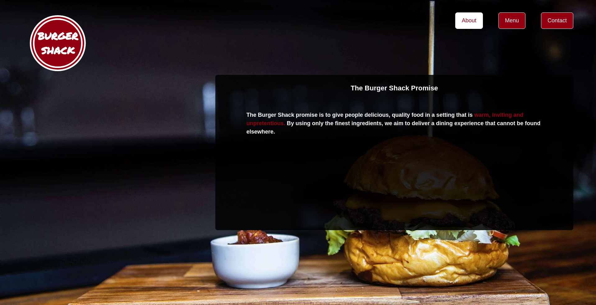

# Restaurant Js

> A simple project built with Javascript



The main goal of this project is to show the understanding of the benefits of modularized code as well as the ability to set up a javascript application made of different modules using webpack.

## Built With

- HTML/CSS,
- JavaScript,
- Webpack,
- npm

## Live Demo

Live Demo Link: [Burger Shack](https://raw.githack.com/ermin-cahtarevic/restaurant-js/restaurant/dist/index.html)

## Getting Started

**Below are the instructions on setting up the project locally.**

To get a local copy up and running follow these simple example steps.

### Setup

```
git clone git@github.com:ermin-cahtarevic/restaurant-js.git
```

### Instalation

```
npm install

npm run build
```

### Run eslint

```
npx eslint .
```

## Author 👤 

- Github: [@ermin-cahtarevic](https://github.com/ermin-cahtarevic)
- Twitter: [@ErminCahtarevic](https://twitter.com/ErminCahtarevic)
- Linkedin: [Ermin Cahtarevic](https://www.linkedin.com/in/ermincahtarevic/)

## 🤝 Contributing

Contributions, issues and feature requests are welcome!

Feel free to check the [issues page](https://github.com/ermin-cahtarevic/restaurant-js/issues).

## Show your support

Give a ⭐️ if you like this project!

## Acknowledgments

- Microverse
- Webpack
- npm
